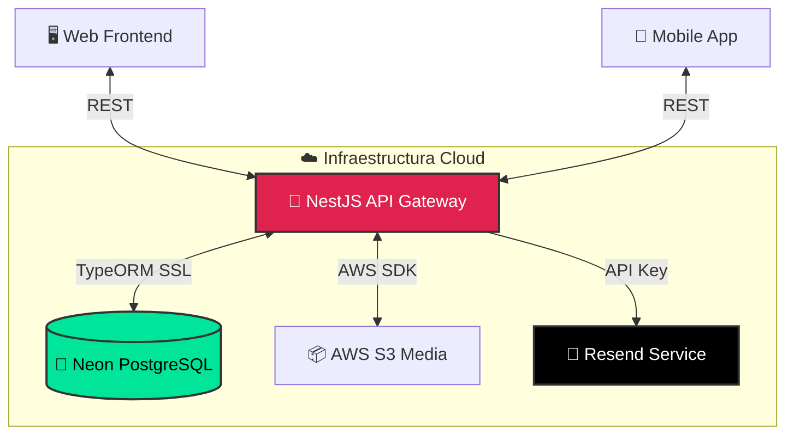
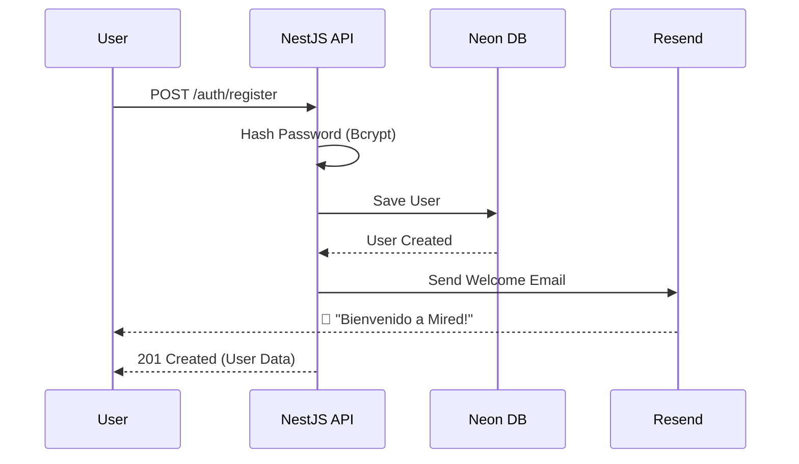

# 🌐 Mired Social - Backend


> **Mired Social** es una iniciativa ambiciosa para construir una plataforma social de última generación. Este repositorio aloja el **Backend Core**, diseñado para servir como cerebro centralizado tanto para aplicaciones Web como Móviles.

---

## 📑 Tabla de Contenidos

1. [Visión y Alcance](#-visión-y-alcance)
2. [Arquitectura del Sistema](#-arquitectura-del-sistema)
3. [Flujos de Autenticación](#-flujos-de-autenticación)
4. [Tech Stack](#-tech-stack)
5. [Bitácora de Progreso](#-progreso-y-bitácora)
6. [Roadmap](#-roadmap-próximos-pasos)
7. [Guía de Replicación (Setup)](#-guía-de-replicación-setup)

---

## 🚀 Visión y Alcance

Nuestro objetivo no es solo otra app social, sino un ecosistema completo y escalable.
- **Multi-Plataforma:** Backend diseñado para clientes Web y Móviles.
- **Escalabilidad Cloud:** Infraestructura Serverless.
- **Experiencia Premium:** Enfoque en performance y seguridad.

---

## 📐 Arquitectura del Sistema



---

## 🔐 Flujos de Autenticación

El sistema implementa un ciclo de vida completo de identidad con notificaciones por correo:



---

## 🏗️ Tech Stack

Hemos seleccionado las mejores tecnologías modernas para cada capa de la aplicación:

### 🧠 Core & Lógica
*   **NestJS**: Framework progresivo y modular.
*   **TypeORM**: ORM potente para TypeScript.

### 💾 Datos & Almacenamiento
*   **Neon (PostgreSQL Serverless)**: Base de datos auto-escalable.
*   **Resend**: Plataforma moderna de correos transaccionales.

### 🛡️ Seguridad
*   **Bcrypt**: Hashing de contraseñas robusto.
*   **Passport & JWT**: Autenticación segura.
*   **Class Validator**: Validación estricta de DTOs.

---

## 📅 Progreso y Bitácora

### ✅ FASE 1: Inicialización e Infraestructura (COMPLETADO)
*Enero 2026*
- **Infraestructura**: Configuración de NestJS, Neon DB y TypeORM con SSL.
- **Documentación**: Implementación de Swagger (`/api`) y Arquitectura.

### ✅ FASE 2: Identidad y Acceso (COMPLETADO)
*Enero 2026*
- **Users Resource**: Entidad `User` con UUID y roles.
- **Auth Module**: Endpoint `/auth/register` funcional.
- **Seguridad**: Hasheo de passwords y DTOs validados.
- **Email System**: Integración con **Resend** para correos de bienvenida.

---

## 🔮 Roadmap (Próximos Pasos)

### 🔜 FASE 3: Gestión de Acceso
- Login con JWT.
- Recuperación de Contraseña (Forgot Password Flow).

### 🗓️ FASE 4: Core Social
- Feed, Publicaciones y Likes.
- Comentarios y Seguidores.

---

## 🛠️ Guía de Replicación (Setup)

### 1. Clonar y Preparar
```bash
git clone https://github.com/marceloemmott-dev/mired-social-backend.git
cd mired-social-backend
npm install
```

### 2. Configurar Entorno (.env)
Copia el ejemplo y añade tus claves de **Neon** y **Resend**:
```bash
cp .env.example .env
```

### 3. Ejecutar
```bash
npm run start:dev
```
Accede a la documentación en: `http://localhost:3000/api`

---
**Creado por Marcelo** 🚀
*"Programando el futuro, hoy."*
